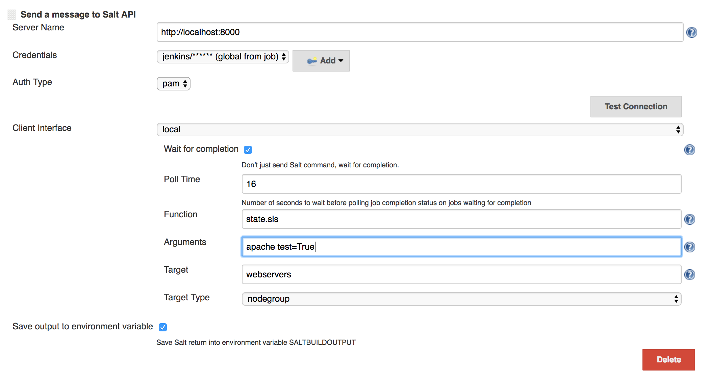
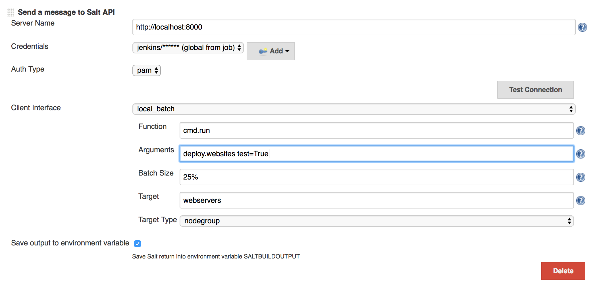
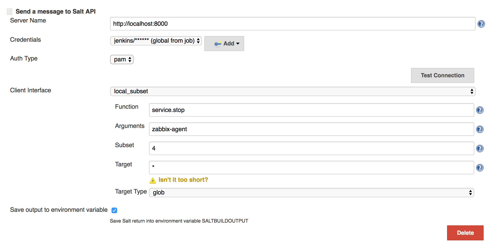
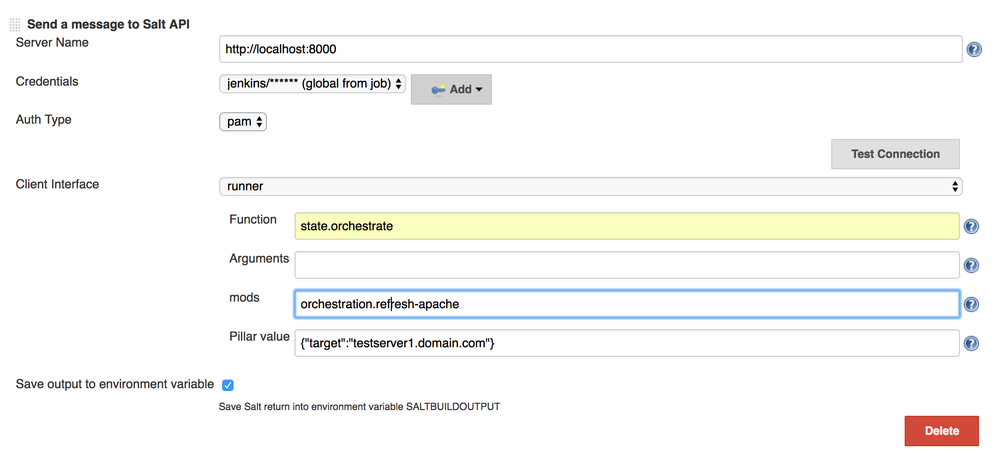
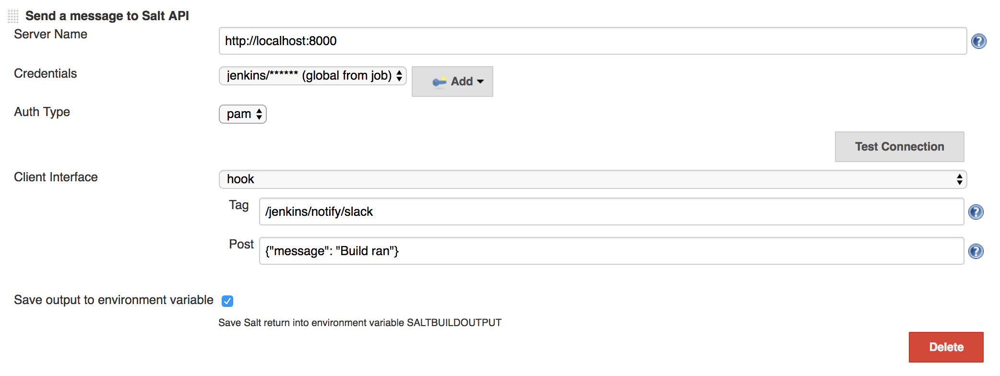
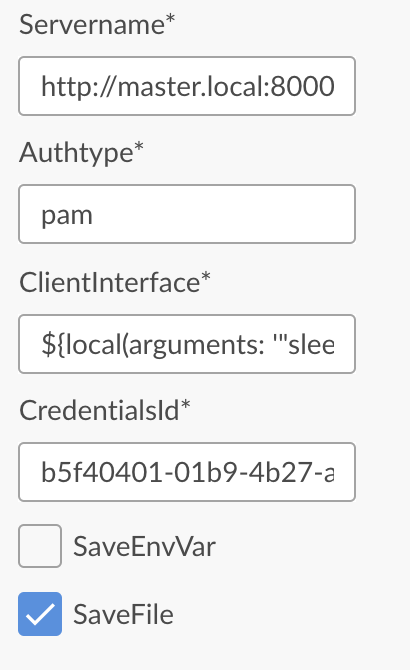

Saltapi Plugin
==============

[](https://plugins.jenkins.io/saltstack)
[](https://github.com/jenkinsci/saltstack-plugin/blob/master/CHANGELOG.md)
[](https://plugins.jenkins.io/saltstack)

This plugin sends a SaltStack API message as a build step

# Basic usage

## Components

Installing this plugin contributes following:

-   **Send a message to Salt API** - Build step

There are a few options for how to run a salt job:

### local

This is the standard way to run a salt command. If command returns
quickly, the results will be returned. Otherwise, if the command is long
running, jenkins will not wait.
If you wish to have jenkins wait for a long running command to finish,
check the "Wait for completion" checkbox.

`Salt syntax: "salt -N nodegroup webservers state.sls apache test=True"`

{width="900"}

### local\_batch

Similar to the local operation, but allows for only running the command
on a few minions at a time. Jenkins will always wait for all minions to
return before finishing, so long running commands will always block the
build until finished.

`Salt syntax: "salt -b '25%' -N nodegroup webservers state.sls deploy.websites test=True"`

{width="900"}

### subset

Also similar to the local operation, but allows for only running the
command on a subset of the target match. Jenkins will always wait for
all minions to return before finishing, so long running commands will
always block the build until finished.

`Salt syntax: salt --subset=4 '*' service.stop zabbix-agent`

{width="900"}

### runner

This allows you to run salt-run commands. It was intended to be used to
kick off salt orchestration jobs

`Salt syntax: salt-run state.orchestrate orchestration.refresh-apache pillar='{"target":testserver1.domain.com}'`

{width="900"}

### hook

This publishes a message to the salt event bus. Useful for integrating
with reactors from Jenkins

```
Curl syntax: curl -sS localhost:8000/hook/jenkins/notify/slack \
    -H 'Content-type: application/json' \
    -d '{"message": "Build ran"}'
```

{width="900"}

## Pipeline

As of the 2.0 release, Jenkins pipeline is supported

```groovy
import groovy.json.*

node() {
  saltresult = salt authtype: 'pam', clientInterface: local(arguments: '"ls -la"', blockbuild: true,
    function: 'cmd.run', jobPollTime: 16, target: '*', targettype: 'glob'),
    credentialsId: 'a3d814c2-84ed-4752-94a8-271791bb5375', servername: 'http://localhost:8000'
  def prettyJson = JsonOutput.prettyPrint(saltresult)
  println(prettyJson)
}
```

## Declarative Pipeline

Declarative pipelines are supported and function with the blueocean
pipeline editor. As of blueocean 1.3 the pipeline editor does not fully
render the input fields and requires some adjustments.

#### Add a step "Send a message to the SaltAPI"

{height="250"} 

| |  |
|-----------------|--------------|
| Servername| http://master.local:8000|
| Authtype| pam|
| ClientInterface | `${local(arguments: '"sleep 3; ls -la"', blockbuild: true, function: 'cmd.run', jobPollTime: 6, target: '\*', targettype: 'glob')}` |
| CredentialsId   | b5f40401-01b9-4b27-a4e8-8ae94bc90250|
| Checkboxes      | SaveFile|

#### Add a second step "Run arbitrary Pipeline script" to print results 

```
env.WORKSPACE = pwd()
def output = readFile "${env.WORKSPACE}/saltOutput.json"
echo output
```


All together this will create a declarative pipeline Jenkinsfile that
looks something like:

**JenkinsFile**

```
pipeline {
  agent {
    node {
      label 'agent1'
    }

  }
  stages {
    stage('saltcommand') {
      steps {
        salt(authtype: 'pam', clientInterface: local(arguments: '"sleep 3; ls -la"', blockbuild: true, function: 'cmd.run', jobPollTime: 6, target: '*', targettype: 'glob'), credentialsId: 'b5f40401-01b9-4b27-a4e8-8ae94bc90250', saveFile: true, servername: 'http://master.local:8000')
        script {
          env.WORKSPACE = pwd()
          def output = readFile "${env.WORKSPACE}/saltOutput.json"
          echo output
        }

      }
    }
  }
}
```

##  Configuration

##### Jenkins

Simply fill out the connection details on the build page.

If using the wait for long commands to finish option, then you may want
to adjust either the poll interval or the minion timeout. The default
for both options are set on in the Jenkins configuration page or the
default can be overwritten from on the individual job.

-   poll interval - controls how often jenkins will check in with the
    saltapi during a long running job. This can be set to something
    short (like 5 seconds) if you have a job that completes somewhat
    quickly. If you have a job that you know will run for an hour,
    checking every 5 seconds is a bit too frequent.
-   minion timeout - If you have a job that should be run on multiple
    minions but only some minions return, the minion timeout will set
    how long to wait for the remaining minions to come back before
    assuming them offline and marking the build as a failure. This is
    helpful as without the timeout, the jenkins salt plugin will wait
    forever for the possibly non-existent minions to return.

Allow the user accessing the salt api to have permission to the
necessary salt modules. Also grant access for the @runner returner.

```yaml
external_auth:
  pam:
    jenkins:
      - test.*
      - pkg.*
      - cmd.*
      - state.*
      - '@runner'
```

This jenkins module was written to use SaltStack's [cherrypy
api](https://salt-api.readthedocs.org/en/latest/ref/netapis/all/saltapi.netapi.rest_cherrypy.html) and
[tornado](https://docs.saltstack.com/en/latest/ref/netapi/all/salt.netapi.rest_tornado.html) (as
of 3.0.0). You will need to add something like the following to your
salt master's configuration

```yaml
rest_cherrypy:
  port: 8000
  ssl_crt: /etc/pki/tls/certs/localhost.crt
  ssl_key: /etc/pki/tls/certs/localhost.key
  expire_responses: False

rest_timeout: 7200
```

*Note: some long running jobs may require increasing the rest\_timeout
or setting the expire\_responses options.*

You can test if you can access the API with the following command
(changing the user and password to the right values).

```
$ curl -sSk https://<salt-master>:8000/login \
    -H 'Accept: application/x-yaml' \
    -d username=jenkins \
    -d password=jenkins \
    -d eauth=pam
```

Which would give you something similar to the following output.
```
return:
  - eauth: pam
    expire: 1458563520.558709
    perms:
      - .*
      - test.*
      - pkg.*
      - cmd.*
      - state.*
      - '@runner'
    start: 1458520320.558709
    token: 634c66d581806e5e9dacefbdc721cba45b78f63c
    user: jenkins
```

## Logging Configuration

To see what is sent/received from the salt-api create a jenkins logger:

    Name: salt logs
    Logger: com.waytta.saltstack
    Log level: ALL

To see what http requests are being sent:

    Name: http
    Logger: sun.net.www.protocol.http.HttpURLConnection
    log level: ALL

*To get any output from http, you may also need to add a default FINEST
Jenkins logger on /jenkins/log/levels*

# Changelog

* For versions 3.2.1 and older, see the [Wiki page](https://wiki.jenkins.io/pages/viewpage.action?pageId=73534062)
